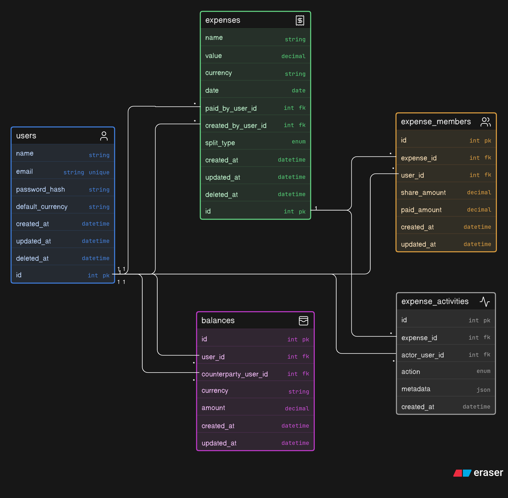

# Splitwise MVP Backend

A simple Splitwise-style backend built with Node.js, Express, Sequelize, and MySQL.

This project supports user management, expenses, expense members, and balance viewing.

[I HAVE USED THE BOILERPLATE REPO PROVIDED IN THE DOCS]
[POSTMAN COLLECTION FILE - postman.json]
---

## Tech Stack

* Node.js
* Express.js
* Sequelize
* MySQL
* Yup validation
* Yarn

---

## Setup

```bash
yarn install
```

Create a `.env` file:

```env
DB_HOST=localhost
DB_PORT=3306
DB_NAME=splitwise_mvp
DB_USER=root
DB_PASS=your_password
```

Run migrations:

```bash
yarn sequelize db:migrate
```

Start the server:

```bash
yarn dev
```

Default base URL:

```txt
http://localhost:3333
```

---

## Database Schema

```md

```


Main tables:

```txt
users
expenses
expense_members
balances
expense_activities
```

Basic idea:

* `users` stores app users.
* `expenses` stores the main bill details.
* `expense_members` connects users and expenses.
* `balances` stores or represents who owes whom.
* `expense_activities` supports future activity logs.

The most important relationship is:

```txt
users -> expense_members <- expenses
```

`expense_members` is the join table because one user can be part of many expenses, and one expense can have many users.

---

## API Endpoints

## Users

### Create user

```http
POST /users
```

Body:

```json
{
  "name": "Aditya",
  "email": "aditya@example.com",
  "password": "password123",
  "default_currency": "INR"
}
```

---

### Get all users

```http
GET /users
```

---

### Get user profile

```http
GET /users/:id
```

Example:

```http
GET /users/1
```

---

### Update user

```http
PATCH /users/:id
```

Example:

```http
PATCH /users/1
```

Body:

```json
{
  "email": "aditya.new@example.com",
  "default_currency": "USD"
}
```

---

### Delete user

```http
DELETE /users/:id
```

Example:

```http
DELETE /users/1
```

---

## Expenses

### Create expense

```http
POST /expenses
```

Body:

```json
{
  "name": "Dinner",
  "value": 3000,
  "currency": "INR",
  "date": "2026-05-22",
  "paid_by_user_id": 1,
  "created_by_user_id": 1,
  "members": [1, 2, 3],
  "notes": "Dinner at cafe"
}
```

---

### Get expenses for a user

```http
GET /expenses?user_id=1
```

---

### Get single expense

```http
GET /expenses/:id
```

Example:

```http
GET /expenses/1
```

---

### Update expense

```http
PATCH /expenses/:id
```

Example:

```http
PATCH /expenses/1
```

Body:

```json
{
  "name": "Updated Dinner",
  "value": 3600,
  "currency": "INR",
  "date": "2026-05-22",
  "paid_by_user_id": 1,
  "members": [1, 2, 3],
  "notes": "Updated dinner amount"
}
```

---

### Delete expense

```http
DELETE /expenses/:id
```

Example:

```http
DELETE /expenses/1
```

---

## Balances

### Get balances for a user

```http
GET /balances?user_id=1
```

Example response:

```json
{
  "data": [
    {
      "user": {
        "id": 2,
        "name": "Rahul",
        "email": "rahul@example.com"
      },
      "currency": "INR",
      "amount": 1000,
      "type": "GETS_BACK"
    }
  ]
}
```

Balance meaning:

```txt
Positive amount = user should receive money
Negative amount = user owes money
```

---

## Test Flow

Use this order while testing in Postman:

```txt
1. Create 3 users
2. Create an expense
3. View expenses for a user
4. View single expense
5. View balances
6. Update expense
7. Delete expense
8. Delete users only at the end
```

---

## Schema Explanation

The `expenses` table stores the bill-level data:

```txt
name
value
currency
date
paid_by_user_id
created_by_user_id
```

The `expense_members` table stores the member-level data:

```txt
expense_id
user_id
share_amount
paid_amount
```

Example:

```txt
Dinner = ₹3000
Members = Aditya, Rahul, Karan
Each share = ₹1000
Aditya paid = ₹3000
Rahul paid = ₹0
Karan paid = ₹0
```

This means Rahul and Karan each owe Aditya ₹1000.

`expense_members` makes balance calculation easier because it tells us who was part of the expense and how much each person should pay.
